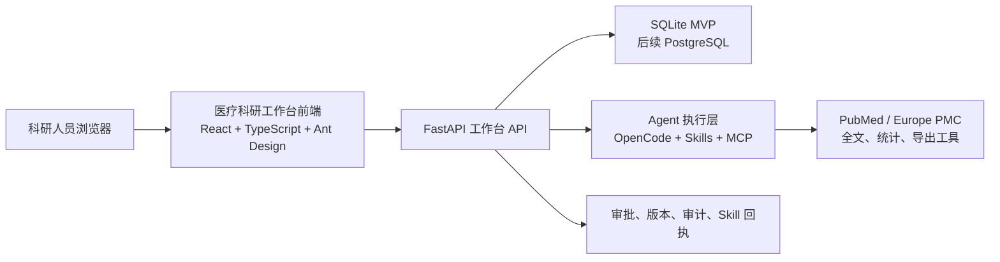

# 四 Agent 医疗科研 B/S 工作台开发计划

## 1. 目标

建设一个面向科研人员的 B/S 医疗科研工作台，将以下四个已实现的 Agent 以同一科研课题为中心组织起来：

1. 临床科研方案设计 Agent
2. 文献检索与综述 Agent
3. 证据抽取与系统评价 Agent
4. 科研写作 Agent

工作台的重点不是替代研究者判断，而是让每个项目的输入、过程、Skills、MCP 工具调用、人工确认、版本和导出成果都可见、可追溯、可复核。

## 2. 产品定位

- 产品形态：院内或私有化部署的 B/S 科研工作台。
- 用户：临床研究者、统计师、科研管理人员、审阅者。
- 当前范围：科研设计、文献检索、证据整理与科研写作，不提供诊疗建议。
- Dify 定位：保留为固定 Workflow 演示入口，不作为四 Agent 正式项目管理界面。
- OpenCode 定位：保留为 Agent 开发、调试和本地执行入口；正式 B/S 用户通过网页完成项目浏览和审批。

## 3. 技术架构



### 3.1 技术选型

- 前端：React、TypeScript、Vite、Ant Design。
- 后端：复用现有 FastAPI、SQLModel、MCP 工具和 SQLite 数据库。
- 后续部署：Docker Compose；生产环境把 SQLite 替换为 PostgreSQL。
- 认证与授权：MVP 支持研究者、审阅者、管理员三种角色。

### 3.2 安全边界

- 不在模型上下文、普通网页或导出包中展示审批密钥。
- 实际 RCT 随机分配序列只保存在受保护存储中，只允许授权试验运营人员读取。
- 所有人工审批记录审批人、时间、范围 Digest、版本与审批结果。
- 不将患者身份信息传入模型、MCP 工具或普通日志。

## 4. 页面设计

### 4.1 科研项目总览

- 项目名称、疾病方向、负责人、创建时间、项目阶段。
- 四个 Agent 状态卡：未开始、进行中、待确认、已导出、异常。
- 待审批事项、最近活动、导出版本、Skill 调用摘要。

### 4.2 项目时间线

- 按时间展示研究设计、文献检索、证据抽取、科研写作的任务链路。
- 每个节点展示输入摘要、执行状态、产物、Skill、MCP 工具、操作者与审计记录。

### 4.3 研究设计页

- 研究问题、PICO、研究类型、纳排标准、结局、样本量与随机化计划。
- 审批前后内容对比、审批范围与 Skill 回执。
- 显示随机表的受控生成状态，不显示实际分配序列。

### 4.4 文献检索与综述页

- 检索式、数据源、真实检索记录、题录导入与去重结果。
- 标题摘要筛选表、研究者确认、PRISMA 流程图、导出包。

### 4.5 证据抽取与系统评价页

- 全文来源、结构化基线/结局字段、撤稿检查与待复核项。
- RoB 2、NOS、QUADAS-2 等质量评价结果。
- Meta 分析、森林图、模型参数与审批状态。

### 4.6 科研写作页

- 来源清单、草稿大纲、方法段、讨论段、局限性与未解决项。
- 版本历史、审批记录与导出入口。

### 4.7 审批与审计中心

- 聚合展示所有待确认事项。
- 审批时显示影响范围、版本、摘要与 Digest，支持批准或拒绝。
- 可查看 Agent、Skill、MCP 调用与导出审计。

## 5. 数据与接口

现有 SQLite 数据库已经保存文献项目、题录、PRISMA、证据抽取、Meta 分析、研究设计、草稿、审批和审计等记录，是当前系统的唯一事实来源。

需要新增一个统一的 `research_workbench_project` 父项目对象，用于关联以下既有记录：

- `study_design_project_id`
- `review_project_id`
- `evidence_workflow_run_id`
- `research_writing_draft_id`

建议新增面向前端的聚合只读 API：

```text
GET /workbench/projects
GET /workbench/projects/{id}/overview
GET /workbench/projects/{id}/timeline
GET /workbench/projects/{id}/artifacts
GET /workbench/approvals
```

现有文献项目可直接复用：

```text
GET /projects
GET /projects/{project_id}
GET /projects/{project_id}/export
GET /projects/{project_id}/prisma
GET /projects/{project_id}/audit-logs
```

研究设计、证据抽取和科研写作需要补充适合前端读取的详情 API；目前其完整成果主要由 MCP 导出工具读取。

## 6. 分阶段实施

### P0：只读工作台

- 建立 React 前端工程与项目总览页。
- 提供四 Agent 的详情页、时间线、产物查看、审批状态和审计记录。
- 复用现有 SQLite 与 FastAPI，不改变 Agent 执行方式。
- 目标：最快将已完成的四 Agent 成果可视化，用于比赛演示。

### P1：统一项目与网页审批

- 增加 `research_workbench_project` 与 Agent 产物关联。
- 增加审批中心和角色权限。
- 将正式审批迁移至网页：查看范围 Digest 后由授权用户批准或拒绝。
- OpenCode 的 Allow/Deny 保留为开发与本地测试机制。

### P2：网页发起与任务进度

- 从网页创建科研项目并发起四类 Agent 任务。
- 展示任务队列、实时状态、失败原因与重试入口。
- 建立受控的 Agent 运行服务，不依赖用户手工输入 OpenCode 提示词。

### P3：部署与扩展

- Docker Compose 私有化部署。
- 生产环境迁移 PostgreSQL、对象存储、统一认证与权限审计。
- 按需接入中文数据库、院内数据平台和合规文件存储。

## 7. 验收标准

- 一个课题可在同一工作台查看四 Agent 的状态和产物。
- 每个产物都能回溯输入、Skill、工具调用、审批和审计记录。
- 未审批的高风险产物不能导出为正式成果。
- 普通用户无法查看随机分配序列或审批密钥。
- 所有临床与统计结论均明确标记为需研究者复核的科研辅助结果。
