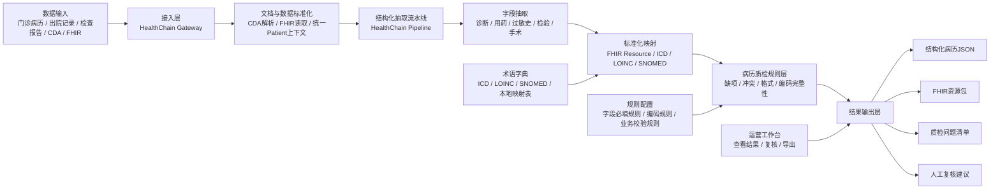

# 基于 HealthChain 的病历结构化与质检助手 MVP 方案

## 1. 背景与目标

目标是围绕医疗业务相关智能体，优先建设一个“小切口、可闭环、可复用”的示范应用。当前优先方向确定为：

- 病历结构化与质检助手

设计原则：

- 优先复用开源项目，尽量少改动
- 默认认为遇到的问题已有大量通用解法，不重复造轮子
- 先做 MVP，先打通闭环，再逐步扩展

## 2. 开源选型结论

在医疗业务相关开源项目里，针对“病历结构化与质检助手”这个方向，`HealthChain` 是当前最合适的底座。

选择原因：

- 它已经解决了大部分通用问题：FHIR/EHR 接入、医疗数据标准化、Pipeline 编排、医疗 API 化部署
- 它比纯文书类项目更贴近“医疗数据资源运营”
- 它比从零搭建抽取与标准化流程的开发量更小

选型判断：

- 如果追求“最快出一个文书类 demo”，`OpenScribe` 更省事
- 如果追求“更贴近病历结构化与质检助手”，`HealthChain` 更合适

本方案采用：

- `HealthChain` 作为底座
- 必要时补充 `FHIR MCP Server` 作为工具层

## 3. HealthChain 能力总结

`HealthChain` 不是一个现成成品应用，而是一个医疗 AI / Agent 集成底座。

它的核心能力包括：

1. FHIR / EHR 连接能力
   - 支持连接真实 FHIR 服务
   - 处理认证、连接池、token 刷新
   - 支持多数据源接入

2. 多源病历聚合能力
   - 聚合多个 FHIR 源的数据
   - 支持 provenance 追踪
   - 支持去重和统一患者视图

3. 类型安全的 FHIR 数据处理能力
   - 使用标准 FHIR 资源对象而不是手写 JSON
   - 支持读取、修改、校验、写回

4. 医疗 Pipeline 能力
   - 支持自定义数据处理流水线
   - 支持医疗 NLP、结构化抽取、映射、推理等流程编排

5. 预置医疗场景骨架
   - `MedicalCodingPipeline`
   - `SummarizationPipeline`
   - `CDS Hooks`
   - `SOAP/CDA / Epic NoteReader CDI`

6. 模型部署能力
   - 可将 ML / LLM / Agent 流程包装成医疗 API
   - 支持接入临床工作流或批处理工作流

适合基于它构建的智能体包括：

- 病历结构化助手
- 病历质检助手
- 多院区患者数据整合助手
- 自动编码助手
- 出院摘要/病程摘要助手
- 实时临床提醒助手

## 4. EHR / FHIR 概念说明

### 4.1 EHR 是什么

`EHR` 是 `Electronic Health Record`，通常可理解为电子健康记录或电子病历系统。

它是医院里真实存储病人数据的业务系统和数据源，比如：

- 门诊病历
- 住院病历
- 检验结果
- 影像报告
- 用药记录
- 诊断与手术信息

可以把它理解为：

- `EHR = 医院里的病人数据源`

### 4.2 FHIR 是什么

`FHIR` 是 `Fast Healthcare Interoperability Resources`，是一套医疗数据交换标准。

它定义了医疗数据应该如何标准化表达和交换，比如：

- `Patient` 表示患者
- `Observation` 表示检验或生命体征
- `Condition` 表示诊断
- `MedicationRequest` 表示处方
- `Encounter` 表示就诊记录

可以把它理解为：

- `FHIR = 医疗数据的标准接口和标准结构`

### 4.3 两者关系

- `EHR` 是数据来源
- `FHIR` 是标准化表达和交换方式

对本项目来说：

1. 从医院系统拿病历数据，这是接 `EHR`
2. 把病历整理成标准结构，这是转成 `FHIR`
3. 质检、输出、对接其他系统，也尽量基于 `FHIR`

## 5. MVP 产品定位

一期不做复杂全院治理平台，而是做一个可演示、可复用的最小闭环：

- 输入一份病历文本、出院记录、检查报告、CDA 或 FHIR 数据
- 自动抽取核心字段
- 映射成标准结构
- 跑一组基础质检规则
- 输出结构化结果、质检问题和人工复核建议

## 6. MVP 架构图

## 7. MVP 功能清单

### 7.1 数据接入

- 支持导入病历文本、出院记录、检查检验报告
- 支持读取 `FHIR` 数据
- 支持解析 `CDA` 文档
- 支持单份文档处理和单患者处理

### 7.2 病历结构化

- 抽取患者基本信息
- 抽取诊断信息
- 抽取用药信息
- 抽取过敏史
- 抽取检验检查结果
- 抽取手术/处置信息
- 生成统一结构化 JSON

### 7.3 标准化映射

- 映射到基础 FHIR 资源
  - `Patient`
  - `Condition`
  - `Observation`
  - `MedicationStatement`
  - `AllergyIntolerance`
  - `Procedure`
- 支持诊断编码映射
- 支持检验项目标准编码映射
- 支持本地字段到标准字段映射

### 7.4 病历质检

- 必填项缺失检查
  - 例如主诊断缺失、过敏史缺失、出院带药缺失
- 字段冲突检查
  - 例如性别与疾病冲突、日期先后矛盾
- 编码完整性检查
  - 例如诊断未编码、检验无标准项
- 格式规范检查
  - 例如时间格式错误、数值单位异常
- 结果分级
  - `高优先级 / 中优先级 / 低优先级`

### 7.5 人工复核

- 展示原文与结构化结果对照
- 展示每条质检问题及原因
- 支持人工确认、忽略、修正
- 导出复核结果

### 7.6 输出与复用

- 导出结构化 JSON
- 导出 FHIR Bundle
- 导出质检报告
- 为科研筛选、商保审核、数据入湖提供统一接口

## 8. 一期建议范围

为了控制开发量，一期建议只覆盖以下 5 个字段域：

1. 患者基本信息
2. 诊断
3. 用药
4. 过敏史
5. 检验结果

这样可以做到：

- 切口小
- 价值明确
- 演示效果好
- 后续容易扩展到手术、病程、影像、随访等更多域

## 9. 一期建议流程

1. 导入一份病历或一位患者资料
2. HealthChain 解析 CDA / FHIR / 文本
3. Pipeline 抽取核心字段
4. 映射成标准结构
5. 规则层跑 10 条以内基础质检规则
6. 输出结构化结果和问题清单
7. 人工复核后导出最终版本

## 10. 最小可演示闭环

输入：

- 一份出院记录或门诊病历

输出：

- 结构化病历摘要
- FHIR 格式结果
- 3 到 10 条质检问题
- 人工复核后的最终版本

这个闭环已经足够作为一个独立的医疗业务智能体示范应用。

## 11. 复用与定制边界

### 11.1 可直接复用 HealthChain 的部分

- FHIR / EHR 接入
- CDA 文档处理
- 医疗 Pipeline 骨架
- FHIR 资源结构与类型安全处理
- 医疗 API / 服务化部署能力

### 11.2 需要本地化定制的部分

- 中文病历抽取适配
- 质检规则库
- 本地术语映射
- 人工复核工作台
- 业务口径配置

## 12. 后续可扩展方向

在 MVP 跑通后，可以继续扩展为：

- 自动编码助手
- 科研病例筛选助手
- 出院摘要助手
- 商保审核前置结构化助手
- 多院区数据整合助手

## 13. 当前结论

当前最合理的技术路线是：

- 用 `HealthChain` 做医疗数据接入、结构化与标准化底座
- 以“病历结构化 + 基础质检 + 人工复核”为一期 MVP
- 不从零搭大而全平台，先用最小闭环验证价值

## 14. 本地部署验证结果

已在本地完成一套最小演示部署，目录如下：

- `/Users/shanbaotao/Documents/agent 2/runtime/healthchain-demo`

当前部署形态：

- 基于 `HealthChain` 的 `CdaAdapter`
- 解析官方样例 `notereader_cda.xml`
- 通过本地 HTTP 服务输出结构化摘要与基础质检结果

当前可访问入口：

- 演示页：`http://127.0.0.1:8011/demo`
- 样例接口：`http://127.0.0.1:8011/api/analyze/sample`
- 接口文档：`http://127.0.0.1:8011/docs`

当前样例解析结果：

- `4` 条问题/诊断
- `1` 条用药
- `0` 条过敏史
- `2` 条基础质检提示
